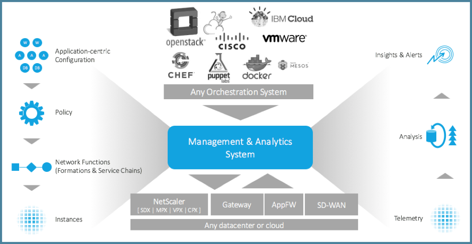

# [NetScaler MAS](https://www.citrix.com/products/netscaler-management-and-analytics-system/)

NetScaler Management and Analytics System (MAS) is a centralized network management, analytics, and orchestration solution. From a single platform, administrators can view, automate, and manage network services for scale-out application architectures. 

View the platforms and functional data sheet to read Citrix's NetScaler MAS full capabilities and benefits to help better manage, control, and gain visibility in delivering your applications. [Click here](https://www.citrix.com/content/dam/citrix/en_us/documents/data-sheet/netscaler-mas-data-sheet.pdf) to learn more.

# Overview 

This repository serves to index and allows for navigation through the growing content specifically focused on NetScaler MAS within the [Citrix-TechSpecialist](https://github.com/Citrix-TechSpecialist) Github organization. Here you can find tutorials, reference guides and auxiliary tools to better accustom yourself with NetScaler MAS and how to better manage and administer enterprise application delivery. 

# Index

Here is a manually updated list every time a new repository or collateral is published for quick navigation to relevant material. 

## [APIC](https://github.com/Citrix-TechSpecialist/NetScaler-MAS/tree/master/APIC)

This guide for the pre-configured Cisco Application Policy Infrastructure Controller (Cisco APICTM) demonstration includes three main modules to configure MAS' integration with Cisco's ACI. In this lab hosted in dCloud, you will learn: 

  1. Building a single tenant with a single- vs a multi-node graph and applying application policies within APIC
  2. Building a single tenant with a single- vs a multi-node graph and applying application policies with Citrix Netscaler MAS
  3. Difference between applying application policies in APIC vs using Netscaler MAS

## [MAS-Stylebooks-101](https://github.com/Citrix-TechSpecialist/MAS-Stylebooks-101)

This repository walks students though the anatomy of a Stylebook and how to create one from scratch to automate NetScaler ADC configurations via MAS. A StyleBook is a YAML formatted template that you can use to create and manage NetScaler configurations for rapid application delivery to desired state. 

